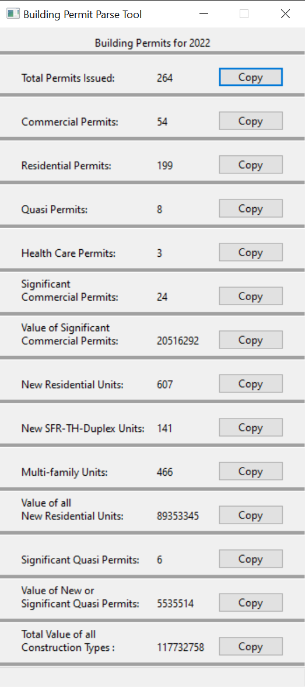

# Udacity C++ Nanodegree Capstone Project

## Building Permit Parse Tool

I don't really have an interest in game development so for the final project in the C++ Nanodegree program I chose to build a project of my choice, a spreadsheet parsing tool to help make work easier for my coworkers in the Kalispell Building Department. 

The tool parses out [building permit information](https://maps.ci.kalispell.mt.us/portal/apps/dashboards/c1da5506e31b484289863bc4790f32e9) from a tracking spreadsheet to quickly provide totals for yearend reports.  The tool automatically loads and parses the sheet for the previous calendar year when run and displays the information to the user.  A "Copy" button near each displayed value loads the information into the operating system clipboard so it can be easily pasted into a report document with minimal effort required by the user.

 

## Dependencies for Running Locally

### CMake

&nbsp;&nbsp;&nbsp;&nbsp;*CMake is used to control the software compilation process using simple platform and compiler independent configuration files, and generate native makefiles and workspaces that can be used in the compiler environment of your choice.*
  * Version 3.13 or higher.
  * All OSes - [Installation instructions](https://cmake.org/install/).

### Make

&nbsp;&nbsp;&nbsp;&nbsp;*Make is a tool which controls the generation of executables and other non-source files of a program from the program's source files.*
* Version 4.1 or higher for Linux or Mac, version 3.81 or higher for Windows.
* Linux - Arch based systems - `sudo pacman -S make` |  Debian based systems - `sudo apt install make`
* Mac - [Install Xcode command line tools](https://developer.apple.com/xcode/features/).
* Windows - [Installation instructions](http://gnuwin32.sourceforge.net/packages/make.htm).

### GCC/G++

&nbsp;&nbsp;&nbsp;&nbsp;*The GNU Compiler Collection includes front ends for C, C++, Objective-C, Fortran, Ada, Go, and D, as well as libraries for these languages (libstdc++,...).*
* Version 5.4 or higher.
* Linux - Arch based systems - `sudo pacman -S gcc` | Debian based systems - `sudo apt install build-essential`
* Mac - [Install Xcode command line tools](https://developer.apple.com/xcode/features/).
* Windows - [Install MinGW](http://www.mingw.org/).

### OpenXLSX

&nbsp;&nbsp;&nbsp;&nbsp;*OpenXLSX is a C++ library for reading, writing, creating, and modifying Microsoft Excel® files, with the .xlsx format.*
* Version 0.3.2 or higher.
* Included in this repo and automatically built when you run cmake.
* See additional details in the included README and the [OpenXLSX GitHub Repository](https://github.com/troldal/OpenXLSX).

### wxWidgets

&nbsp;&nbsp;&nbsp;&nbsp;*wxWidgets is a C++ library that lets developers create applications for Windows, macOS, Linux and other platforms with a single code base.*
  * All OSes - [Installation instructions](https://wiki.wxwidgets.org/Install).

## Basic Build Instructions

1. Clone this repo.
2. Make and cd into a build directory: `mkdir build && cd build`
3. Compile: `cmake .. && make`
4. Ensure the spreadsheet to be parsed is in the same directory as the tool binary. &nbsp;&nbsp;&nbsp;&nbsp;*A test spreadsheet has been included to demonstrate functionality, it will automatically be copied to the build directory during compilation.*
5. Run: `./BuildingPermitParser`

## Rubric Points Addressed

1. The project demonstrates an understanding of C++ functions and control structures: `parser.cpp` lines 41 through 278.
2. The project reads data from a file and processes the data, or the program writes data to a file: `parser.cpp` lines 119 through 263.
3. The project uses Object Oriented Programming techniques: `parser.hpp`
4. Classes use appropriate access specifiers for class members: `parser.hpp` lines 23 & 48.
5. Class constructors utilize member initialization lists: `parser.cpp` lines 3 through 36.
6. Classes abstract implementation details from their interfaces: `parser.hpp` & `parser.cpp`
7. The project makes use of references in function declarations: `parser.hpp` lines 42 through 46 and lines 60 through 66.
